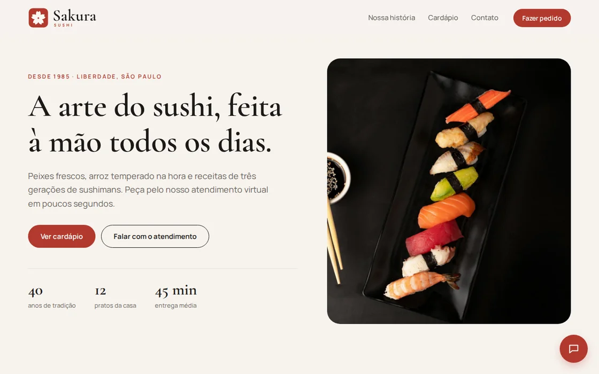
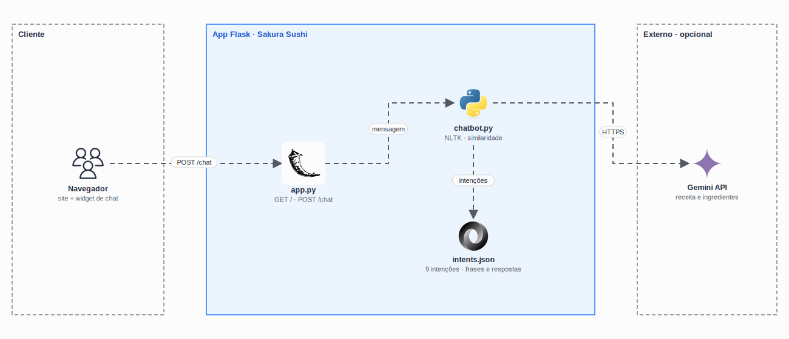

<p align="center">
  <picture>
    <source media="(prefers-color-scheme: dark)" srcset="docs/logo-clara.svg" />
    
  </picture>
</p>

<h1 align="center">
  CP3 - Chatbot de atendimento com NLP e Gemini
</h1>

<p align="center">
  
</p>

<p align="center">
  <a href="https://skillicons.dev">
    
  </a>
</p>

## Qual a finalidade do projeto?

Checkpoint 3 da disciplina de **Inteligência Artificial** (FIAP, 2º semestre de 2025). O projeto é o site do restaurante fictício **Sakura Sushi** com um **chatbot de atendimento** que entende o que o cliente escreve e responde de acordo com a **intenção** da mensagem: pedido, preço, prazo de entrega, reclamação, horário, formas de pagamento e outras.

O reconhecimento é feito com **processamento de linguagem natural** em Python (NLTK): a mensagem é quebrada em frases, cada frase é tokenizada e limpa, e o bot compara as palavras com os exemplos de cada intenção. Uma mesma mensagem pode ter **várias intenções**, e o chat mostra qual foi detectada e com que confiança.

No Checkpoint 3 foi adicionada a intenção **ingredientes**: o cliente escolhe um ou mais pratos de uma lista e o bot busca a **receita e os ingredientes na API do Google Gemini**.

## Arquitetura

<p align="center">
  
</p>

## O que foi construído

### Intenções

| Grupo | Intenções |
|---|---|
| Atendimento | `cumprimento`, `agradecimento`, `despedida`, `reclamacao` |
| Pedido | `compra`, `itens_disponiveis`, `precos`, `tempo_entrega`, `forma_pagamento` |
| Restaurante | `localizacao`, `horario_funcionamento`, `promocoes_ofertas`, `eventos_grupos` |
| Cardápio | `ingredientes_qualidade`, `informacoes_nutricionais`, `curiosidades_cultura` |
| Checkpoint 3 | `ingredientes`: seleção de pratos e consulta ao Gemini |

São **17 intenções**, com mais de **2.300 frases de exemplo** e **115 respostas** em `intents.json`.

### Funcionalidades

| Funcionalidade | Como funciona |
|---|---|
| Várias frases por mensagem | Cada frase é analisada separadamente e as respostas são combinadas |
| Intenção e confiança | O chat mostra a intenção detectada e a probabilidade de cada resposta |
| Reconhecimento de pratos | Identifica o prato citado (hot roll, temaki, yakissoba…) e personaliza a resposta |
| Receita via Gemini | Na intenção `ingredientes`, o cliente escolhe pratos e o bot consulta o Gemini |
| Site do restaurante | Página com história, cardápio com fotos e contato, e o chat como widget flutuante |
| Chat leve | Abre com animação simples, mostra "digitando…" enquanto espera e traz atalhos de perguntas |

### Rotas

| Rota | O que faz |
|---|---|
| `GET /` | Site do Sakura Sushi com o widget do chat |
| `POST /chat` | Recebe `{ "message": "..." }` e devolve resposta, intenção e confiança |
| `GET /intents` | Lista as intenções carregadas |

## Tecnologias utilizadas

- **Python + Flask:** API do chatbot e páginas do site;
- **NLTK:** tokenização e *stopwords* em português;
- **Google Gemini API:** receitas e ingredientes (opcional);
- **HTML, CSS e JavaScript:** site responsivo e widget de chat, sem bibliotecas no front;
- **Cormorant Garamond e Manrope:** tipografia do site (Google Fonts);
- **Jupyter Notebook:** enunciado e exploração do Checkpoint 3.

## Estrutura do repositório

```text
fiap-ia-cp3/
├── app.py               # Flask: site, /chat e /intents
├── chatbot.py           # NLP: pré-processamento, similaridade e Gemini
├── intents.json         # Intenções, frases de exemplo e respostas
├── templates/
│   ├── home.html        # Site do Sakura Sushi com o widget
│   └── index.html       # Versão só com o chat
├── static/
│   ├── css/style.css    # Estilos do site e do chat
│   ├── js/script.js     # Chat: envio, "digitando…" e intenções
│   └── img/             # Logo, selo e fotos do cardápio
├── checkpoint6.ipynb    # Enunciado do checkpoint
├── docs/                # Demo e diagrama
└── requirements.txt
```

## Fluxo de funcionamento

1. O cliente escreve no chat e o front envia `POST /chat`.
2. O `chatbot.py` separa a mensagem em frases, tokeniza e remove *stopwords*.
3. Cada frase é comparada com as frases de exemplo de cada intenção, com um *fallback* por palavras-chave.
4. O bot escolhe uma resposta da intenção mais provável e, se reconhecer um prato, personaliza o texto.
5. Na intenção `ingredientes`, ele devolve a lista de pratos; com a escolha do cliente, consulta o Gemini e responde com a receita.

## Como rodar

```bash
python3 -m venv .venv && source .venv/bin/activate
pip install -r requirements.txt
export GEMINI_API_KEY="sua-chave"   # opcional, só para a intenção ingredientes
python app.py                       # http://localhost:5000
```

A chave do Gemini é gerada em [Google AI Studio](https://aistudio.google.com/app/apikey). Não coloque a chave no código: use a variável de ambiente.

## Como validar a entrega

Frases para testar no chat:

| Frase | Intenções detectadas |
|---|---|
| "Oi! Quanto custa o temaki e qual o tempo de entrega?" | `cumprimento`, `compra` (temaki), `tempo_entrega` |
| "Quero pedir um hot roll" | `compra`, com o prato reconhecido |
| "O pedido chegou frio" | `reclamacao` |
| "Onde fica o restaurante?" | `localizacao` |
| "Quais as formas de pagamento?" | `forma_pagamento` |
| "Quais são os ingredientes?" | `ingredientes`, com a lista de pratos |
| "Muito obrigado, tchau!" | `despedida` |

Pontos principais de validação:

- cada resposta mostra a intenção e a confiança;
- mensagens com mais de uma frase recebem uma resposta para cada frase;
- com a `GEMINI_API_KEY` definida, escolher um prato devolve a receita.

## Créditos

Fotos dos pratos: [Unsplash](https://unsplash.com) (licença Unsplash). O restaurante e os dados de contato são fictícios.

---

## Autor

**William Alves Coelho** · RM 556336 · [@willtechdev](https://github.com/willtechdev)
